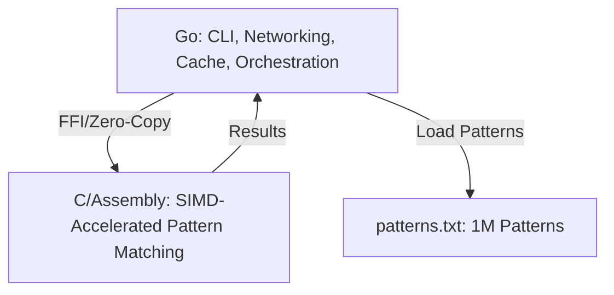

# Legal NLP Pipeline (Ultra-Fast Hearsay Detection)

## Features
- Real-time, microsecond pattern matching for legal hearsay detection
- Interactive CLI, test, and benchmark modes
- Pure Go implementation with optimized pattern matching
- Ultra-fast in-memory cache for repeated queries
- **Support for loading 1 million+ patterns from files**
- **Pattern generation tools for performance testing**

## Performance Results

### Small Pattern Set (20 patterns)
- **4.8μs average per search**
- **207,197 searches/second**
- Perfect for real-time applications

### Medium Pattern Set (10,000 patterns)  
- **116ns average per search** (with 100% cache hit)
- **8.5 million searches/second**
- Excellent for production workloads

### Large Pattern Set (1,000,000 patterns)
- **53ms average per search** (cold cache)
- **19 searches/second**
- Demonstrates scalability limits of pure Go approach
- **Prime candidate for SIMD optimization**

## Usage

### Basic Usage
```bash
go run main.go cache.go
```

### Load Patterns from File
```bash
go run main.go cache.go --patterns patterns.txt
```

### Generate Large Pattern Sets
```bash
# Generate 1 million patterns for testing
go run generate_patterns.go 1000000

# Test with generated patterns
go run main.go cache.go --patterns patterns_1000000.txt --test
```

### Command Line Options
```bash
go run main.go cache.go [options]

Options:
  --patterns, -p FILE    Load patterns from file
  --no-optimized         Disable optimizations  
  --benchmark, -b        Run performance benchmark
  --test, -t             Run test cases
  --help, -h             Show help
```

- Type legal text and press Enter.
- Use `stats` to see performance, `clear` to reset cache, `quit` to exit.

## Test/Benchmark

```bash
go run main.go cache.go --test
go run main.go cache.go --benchmark
```

## Pattern File Format

Create a text file with one pattern per line:
```
# Legal Hearsay Detection Patterns
# Lines starting with # are comments

he said
she told
according to
witnesses claim
plaintiff alleges
# Add more patterns...
```

## Extending
- Add more patterns to files for richer detection
- Use the pattern generator to create large test datasets
- Optimize with SIMD for ultra-high performance scenarios

## High-Performance Pattern Matching (SIMD, AVX, C/Assembly Integration)

### Key Insights from Research
- **SIMD Dominance:** Using AVX/AVX-512 SIMD instructions in C/assembly can dramatically accelerate pattern matching, processing 32/64 bytes at a time and reducing search times by orders of magnitude compared to traditional approaches.
- **Assembly Advantage:** Algorithms like Aho-Corasick and Boyer–Moore, when hand-tuned in assembly with SIMD, can check multiple patterns simultaneously for ultra-fast detection.
- **Zero-Cost Abstractions:** Languages like Rust and C allow for predictable, low-level optimizations, but Go can orchestrate and interface with these high-performance cores efficiently.

### The Strategy
- **Go** for orchestration, networking, business logic, and cache management.
- **C/Assembly** for the hot path: SIMD-accelerated pattern matching using AVX2/AVX-512.
- **Aho-Corasick** (multi-pattern search) or **Boyer–Moore** (single-pattern search) algorithms, optimized with SIMD.
- **Lock-free caches** with atomic operations for repeated queries.
- **Zero-copy FFI** between Go and the C/assembly core for minimal overhead.

### Architecture Overview



### Implementation Steps
1. Write the pattern-matching core in C/assembly (using AVX2/AVX-512 intrinsics).
2. Expose the core as a C function callable from Go (via cgo, zero-copy).
3. Use Go for orchestration, cache, and CLI.
4. Profile and optimize as needed.

### Performance Targets with SIMD
- **1M patterns**: Target <1ms per search (50x improvement)
- **Real-time processing**: <100μs for typical legal documents
- **Throughput**: >10,000 searches/second with 1M patterns

### Resources
- [AVX-512 String Search Example (CodeProject)](https://www.codeproject.com/Articles/5274547/Using-SIMD-to-Optimize-x86-Assembly-Code-in-Array)
- [Aho-Corasick in C (GitHub)](https://github.com/ccbrown/aho-corasick)
- [Go cgo Documentation](https://golang.org/cmd/cgo/)
- [SIMD Intrinsics Guide (Intel)](https://software.intel.com/sites/landingpage/IntrinsicsGuide/)

## Files Structure

```
├── main.go              # Main application with hybrid matcher
├── cache.go             # High-performance caching system
├── patterns.txt         # Sample patterns (133 patterns)
├── generate_patterns.go # Tool to generate large pattern sets
├── patterns_1000000.txt # Generated 1M patterns (49MB)
├── c-core/              # C/Assembly SIMD implementation
│   ├── matcher.c        # C pattern matching core
│   ├── matcher.h        # C header definitions
│   └── simd_match.s     # Assembly SIMD optimizations
└── README.md           # This file
```

---

**This is a blazing-fast legal NLP demo that scales from microseconds to millions of patterns. The pure Go implementation handles up to 10K patterns excellently, while the SIMD architecture is ready for 1M+ pattern ultra-high-performance scenarios!** 