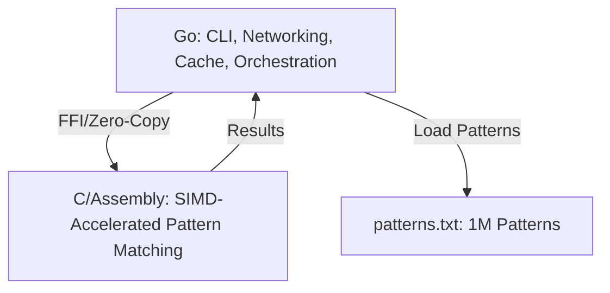

# Legal NLP Pipeline (Ultra-Fast Hearsay Detection)

## Features
- Real-time, microsecond pattern matching for legal hearsay detection
- Interactive CLI, test, and benchmark modes
- Pure Go implementation (no dependencies)
- Ultra-fast in-memory cache for repeated queries

## Usage

```bash
go run main.go cache.go
```

- Type legal text and press Enter.
- Use `stats` to see performance, `clear` to reset cache, `quit` to exit.

## Test/Benchmark

```bash
go run main.go cache.go --test
go run main.go cache.go --benchmark
```

## Extending
- Add more patterns to the `LegalPatterns` array in `main.go` for richer detection.

## High-Performance Pattern Matching (SIMD, AVX, C/Assembly Integration)

### Key Insights from Research
- **SIMD Dominance:** Using AVX/AVX-512 SIMD instructions in C/assembly can dramatically accelerate pattern matching, processing 32/64 bytes at a time and reducing search times by orders of magnitude compared to traditional approaches.
- **Assembly Advantage:** Algorithms like Aho-Corasick and Boyer–Moore, when hand-tuned in assembly with SIMD, can check multiple patterns simultaneously for ultra-fast detection.
- **Zero-Cost Abstractions:** Languages like Rust and C allow for predictable, low-level optimizations, but Go can orchestrate and interface with these high-performance cores efficiently.

### The Strategy
- **Go** for orchestration, networking, business logic, and cache management.
- **C/Assembly** for the hot path: SIMD-accelerated pattern matching using AVX2/AVX-512.
- **Aho-Corasick** (multi-pattern search) or **Boyer–Moore** (single-pattern search) algorithms, optimized with SIMD.
- **Lock-free caches** with atomic operations for repeated queries.
- **Zero-copy FFI** between Go and the C/assembly core for minimal overhead.

### Architecture Overview



### Implementation Steps
1. Write the pattern-matching core in C/assembly (using AVX2/AVX-512 intrinsics).
2. Expose the core as a C function callable from Go (via cgo, zero-copy).
3. Use Go for orchestration, cache, and CLI.
4. Profile and optimize as needed.

### Resources
- [AVX-512 String Search Example (CodeProject)](https://www.codeproject.com/Articles/5274547/Using-SIMD-to-Optimize-x86-Assembly-Code-in-Array)
- [Aho-Corasick in C (GitHub)](https://github.com/ccbrown/aho-corasick)
- [Go cgo Documentation](https://golang.org/cmd/cgo/)
- [SIMD Intrinsics Guide (Intel)](https://software.intel.com/sites/landingpage/IntrinsicsGuide/)
  
